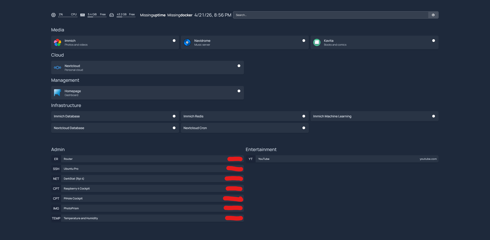
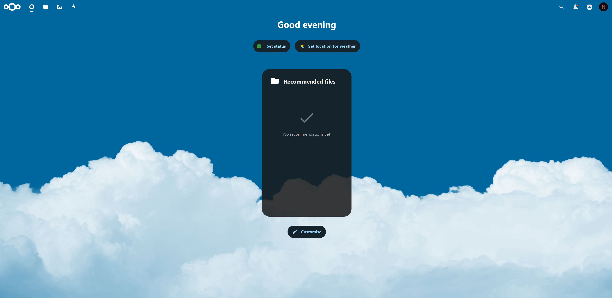
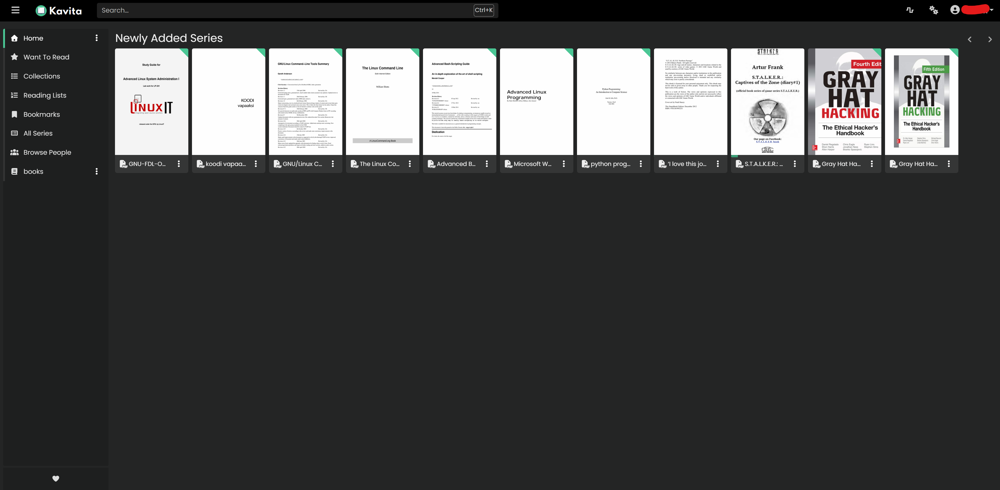
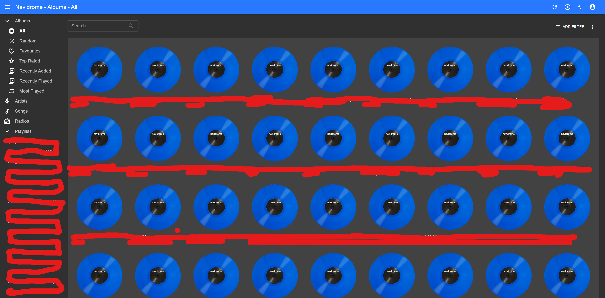

# Raspberry Pi 5 Self-Hosted Server (Ubuntu + Docker)

This repository documents the design, deployment, and troubleshooting of a self-hosted server built on Raspberry Pi 5 running Ubuntu Server.

The project focuses on real-world infrastructure challenges: multi-service orchestration, network storage, remote access, and debugging issues in a live environment.

---

## 🧱 Overview

- Platform: Raspberry Pi 5
- OS: Ubuntu Server
- Containerization: Docker
- Storage: NFS-mounted media from another device
- Remote access: Tailscale VPN

---

## 🚀 Services

The server hosts multiple self-hosted services:

- **Navidrome** – Music streaming server
- **Kavita** – E-book and PDF library server
- **Nextcloud** – Personal cloud storage

---

## Screenshots

Example views from the running system:

---

## 🗂️ Architecture

- Docker-based service isolation
- External media storage mounted via NFS
- Services rely on shared mounted paths (`/srv/media/...`)
- Remote access handled through a private VPN (Tailscale)

---

## 💾 Storage & Mounts

Media is stored on a separate device and mounted via NFS.

Key lessons:
- Incorrect mounts can silently break applications
- Services may detect files without being able to access them
- Proper `/etc/fstab` configuration is critical for reliability

---

## 🐳 Example Docker Configuration

Example Docker Compose configurations used in this setup can be found in the `docker/` directory.

These are simplified and sanitized versions of the actual production setup.

---

## 🌐 Remote Access

Initially tested with NordVPN Meshnet, but transitioned to Tailscale due to:

- Simpler setup
- Better reliability with mobile clients
- More predictable behavior with Dockerized services

---

## 🧪 Troubleshooting Highlights

This project includes real-world debugging scenarios:

- Navidrome showing a library but unable to play files → caused by missing NFS mount
- Empty mount points leading to "ghost" media libraries
- Kavita not detecting files due to incorrect directory structure
- Remote access inconsistencies depending on VPN solution

---

## 📚 Lessons Learned

- Self-hosting is not just deployment — it's ongoing system design
- Storage layers (NFS, mounts) are critical and often overlooked
- Networking choices directly impact usability
- Debugging is a core part of infrastructure work

---

## 📌 Purpose

This repository is not a step-by-step tutorial.

It is a **practical case study** demonstrating:
- System architecture decisions
- Real troubleshooting workflows
- Integration of multiple self-hosted services

---

## 🔮 Future Improvements

- Add monitoring and logging dashboard
- Improve backup strategy
- Introduce reverse proxy (e.g. Nginx)
- Harden security (Fail2ban, access control)

---

## 👤 Author

Built and maintained as a personal infrastructure project.
